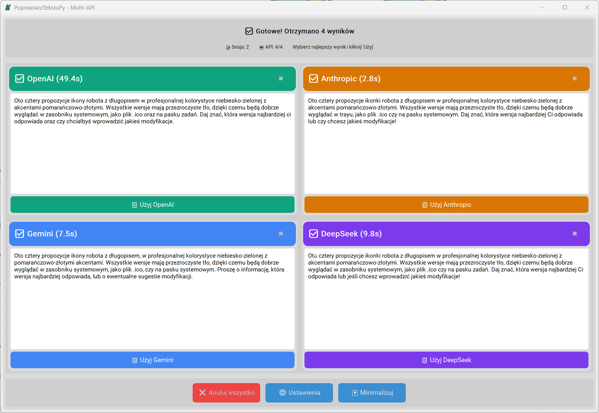

# PoprawiaczTekstuPy

Nowoczesna aplikacja do automatycznej korekty tekstu z wykorzystaniem AI. Aplikacja wysyła tekst jednocześnie do 4 AI providers (OpenAI, Anthropic, Gemini, DeepSeek) i pozwala wybrać najlepszą korektę.


## 📸 Zrzut ekranu



*Interfejs aplikacji z 4 panelami AI, animacjami i kolorowymi rezultatami*

## ✨ Funkcje

- 🎨 **Nowoczesny interfejs** - CustomTkinter z 4-panelowym layoutem
- ⚡ **Globalny hotkey** - Ctrl+Shift+C automatycznie kopiuje zaznaczony tekst
- 🔄 **System tray** - aplikacja w zasobniku systemowym z powiadomieniami
- 🤖 **4 AI jednocześnie** - OpenAI, Anthropic, Gemini, DeepSeek w osobnych panelach
- 📋 **Auto-paste** - Ctrl+V automatycznie wkleja wybraną korektę
- 🎬 **Animacje** - GIF loadery podczas przetwarzania
- ⚙️ **Anulowanie** - nowy hotkey anuluje poprzednie zapytania
- 🎨 **Kolorowe panele** - każdy AI ma swój unikalny kolor

## 🚀 Instalacja

### Option 1: Pobierz gotowy executable
1. Idź do [Actions](https://github.com/jarx88/PoprawiaczTekstuPy/actions)
2. Wybierz najnowszy successful build
3. Pobierz artifact dla swojego systemu:
   - **Windows**: `popraw-tekst-corrector-windows`
   - **Linux**: `popraw-tekst-modern-linux`

### Option 2: Uruchom z kodu źródłowego
```bash
git clone https://github.com/jarx88/PoprawiaczTekstuPy.git
cd PoprawiaczTekstuPy
pip install -r requirements.txt
python main_corrector.py
```

## ⚙️ Konfiguracja

1. Uruchom aplikację
2. Kliknij **Ustawienia**
3. Wpisz swoje API keys:
   - OpenAI: `sk-...`
   - Anthropic: `sk-ant-...`
   - Gemini: `AIza...`
   - DeepSeek: `sk-...`

## 🎯 Użycie

### Workflow aplikacji
1. **Zaznacz tekst** w dowolnej aplikacji
2. **Naciśnij Ctrl+Shift+C** - aplikacja automatycznie skopiuje tekst
3. **Obserwuj 4 panele** - każdy AI przetwarza tekst z animowanym loaderem
4. **Kliknij najlepszy wynik** - zostanie podświetlony na zielono
5. **Ctrl+V** - aplikacja automatycznie wklei wybraną korektę

### Panele AI
- 🟢 **OpenAI** (zielony) - GPT-4 models
- 🟠 **Anthropic** (pomarańczowy) - Claude models  
- 🔵 **Gemini** (niebieski) - Google AI
- 🟣 **DeepSeek** (fioletowy) - DeepSeek Chat

## 🔧 Development

### Budowanie lokalnie
```bash
# CustomTkinter version (aktualny)
pyinstaller popraw_tekst_corrector.spec

# Linux version  
pyinstaller popraw_tekst_linux.spec
```

### GitHub Actions
Projekt używa GitHub Actions do automatycznego budowania:
- **Push na main/master** - automatyczny build
- **Tags (v*.*.*)** - tworzenie release z executables
- **Manual trigger** - ręczne uruchomienie workflow

## 📦 Technologie

- **GUI**: CustomTkinter (nowoczesny design, lekki)
- **Animacje**: PIL + tkinter (GIF loaders)
- **System Tray**: pystray z powiadomieniami
- **Hotkeys**: pynput (thread-safe, globalne)
- **Clipboard**: pyperclip (multi-platform)
- **AI APIs**: OpenAI, Anthropic, Gemini, DeepSeek
- **Build**: PyInstaller + GitHub Actions
- **Session Management**: threading z cancel flags

## 🐛 Rozwiązywanie problemów

### Windows
- Jeśli antywirus blokuje: dodaj wyjątek
- Jeśli hotkey nie działa: uruchom jako administrator

### Linux
- Zainstaluj tkinter: `sudo apt install python3-tk`
- Problemy z X11: ustaw `export DISPLAY=:0`

## 📝 Historia zmian

### v2.0.0 (Aktualny - CustomTkinter)
- ✅ **Pełna migracja** z PyQt6 na CustomTkinter
- ✅ **4-panelowy layout** z jednoczesnym przetwarzaniem
- ✅ **Animowane loadery** GIF dla każdego API
- ✅ **Session management** z anulowaniem poprzednich zapytań
- ✅ **Auto-paste workflow** - Ctrl+Shift+C → wybór → Ctrl+V
- ✅ **Kolorowe panele** - unikalne kolory dla każdego AI
- ✅ **GitHub Actions** - automatyczne Windows builds
- ✅ **System tray** z powiadomieniami pystray

### v1.0.0
- ✅ Podstawowa funkcjonalność z PyQt6
- ✅ Thread-safe hotkey handling
- ✅ Obsługa wielu AI providers

## 🤝 Współpraca

1. Fork projektu
2. Stwórz branch dla swojej funkcji
3. Commit zmiany
4. Push do brancha
5. Otwórz Pull Request

## 📄 Licencja

[MIT License](LICENSE)

## ❓ FAQ

**Q: Dlaczego Wine build nie działa?**
A: Wine nie może wykonać Windows Python z współdzielonego WSL/Windows venv. GitHub Actions budują natywnie na Windows.

**Q: Dlaczego aplikacja pokazuje 4 panele zamiast jednego wyniku?**
A: To jest workflow aplikacji - porównujesz wyniki z 4 AI jednocześnie i wybierasz najlepszy.

**Q: Jak anulować przetwarzanie?**
A: Naciśnij ponownie Ctrl+Shift+C - anuluje poprzednie zapytania i rozpoczyna nowe.

**Q: Jak dodać nowy AI provider?**
A: Dodaj klienta w `api_clients/` i zaktualizuj `main_corrector.py`.

**Q: Czy mogę używać bez internetu?**
A: Nie, aplikacja wymaga połączenia z internetem dla AI APIs.

---

💡 **Pro tip**: Użyj GitHub Actions do automatycznego budowania - rozwiązuje wszystkie problemy z cross-compilation!